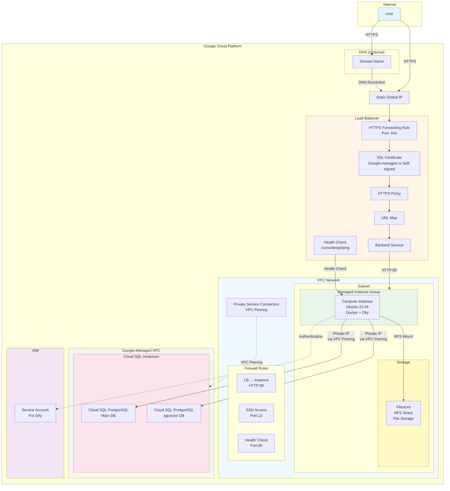

# Dify on Google Cloud - Terraform Deployment
<a id="markdown-dify-on-google-cloud---terraform-deployment" name="dify-on-google-cloud---terraform-deployment"></a>

This Terraform code deploys Dify on Google Cloud Platform (GCP).

It uses the Dify Community Edition with focus on the following principles:

- Follow Dify Community Edition upgrades.
- Minimize modifications to the Dify Community Edition codebase.
- Use managed services for database and file storage.

## Table of Contents
<a id="markdown-table-of-contents" name="table-of-contents"></a>

<!-- TOC -->

- [Dify on Google Cloud - Terraform Deployment](#dify-on-google-cloud---terraform-deployment)
    - [Table of Contents](#table-of-contents)
    - [Components](#components)
    - [Architecture](#architecture)
    - [Cost Estimation](#cost-estimation)
    - [Prerequisites](#prerequisites)
    - [Quick Start](#quick-start)
        - [Prepare Variables File](#prepare-variables-file)
        - [Deploy](#deploy)
        - [After Deployment](#after-deployment)
    - [Detailed Configuration](#detailed-configuration)
        - [SSL Certificate Setup](#ssl-certificate-setup)
            - [Option 1: Google-Managed SSL Certificate Recommended](#option-1-google-managed-ssl-certificate-recommended)
            - [Option 2: Self-Signed Certificate](#option-2-self-signed-certificate)
        - [Additional Sandbox Packages](#additional-sandbox-packages)
    - [Dify Deployment](#dify-deployment)
        - [Upgrada Strategy](#upgrada-strategy)
    - [Troubleshooting](#troubleshooting)
        - [Verify SSL Certificate Provisioning](#verify-ssl-certificate-provisioning)
        - [Check startup script log](#check-startup-script-log)
        - [Check Dify logs](#check-dify-logs)
    - [Resource Cleanup](#resource-cleanup)

<!-- /TOC -->

## Components
<a id="markdown-components" name="components"></a>

This Terraform code creates the following resources:

- **Network**
  - VPC network and subnet
  - Private Service Access (for Cloud SQL)
  - Firewall rules
  - Static external IP address (for Load Balancer)

- **Database**
  - Cloud SQL (PostgreSQL) - Main database
  - Cloud SQL (PostgreSQL with pgvector) - Vector database

- **Storage**
  - Filestore - For file uploads and plugin assets

- **Compute**
  - Managed Instance Group
  - Custom startup script to install and run Dify

- **Load Balancer**
  - HTTPS Load Balancer
  - SSL certificates (managed or self-signed)

- **IAM**
  - Service account for Dify
  - Automatic granting of required permissions

## Architecture
<a id="markdown-architecture" name="architecture"></a>



## Cost Estimation
<a id="markdown-cost-estimation" name="cost-estimation"></a>

[](https://dashboard.infracost.io/org/nenegi01mo/repos/d8e48f68-1e25-418e-9539-39a0e8ad0119?tab=branches)

## Prerequisites
<a id="markdown-prerequisites" name="prerequisites"></a>

1. **Google Cloud SDK**: `gcloud` command installed
2. **Terraform**: Version 1.0 or higher
3. **GCP Project**: Active GCP project
4. **Authentication Setup**:
   ```bash
   gcloud init
   gcloud auth application-default login
   ```
5. **Enable Required APIs**:
   ```bash
   gcloud services enable cloudresourcemanager.googleapis.com
   gcloud services enable compute.googleapis.com
   gcloud services enable file.googleapis.com
   gcloud services enable iamcredentials.googleapis.com
   gcloud services enable servicenetworking.googleapis.com
   gcloud services enable sqladmin.googleapis.com
   ```

## Quick Start
<a id="markdown-quick-start" name="quick-start"></a>

### 1. Prepare Variables File
<a id="markdown-prepare-variables-file" name="prepare-variables-file"></a>

```bash
cp terraform.tfvars.example terraform.tfvars
```

Edit `terraform.tfvars` and set at least the following values:

```hcl
project_id = "your-gcp-project-id"

# Dify version to be deployed
dify_version = "1.11.4"

# If you have a domain name (recommended)
domain_name = "dify.example.com"

# Or use self-signed certificate
# domain_name     = ""
# ssl_certificate = file("certificate.pem")
# ssl_private_key = file("private-key.pem")
```

### 2. Deploy
<a id="markdown-deploy" name="deploy"></a>

```bash
# Initialize
terraform init

# Review plan
terraform plan

# Execute deployment
terraform apply
```

### 3. After Deployment
<a id="markdown-after-deployment" name="after-deployment"></a>

```bash
# Check admin password
terraform output -raw dify_admin_password

# Access via browser
# https://<load_balancer_ip> or https://your-domain.com
```

## Detailed Configuration
<a id="markdown-detailed-configuration" name="detailed-configuration"></a>

### SSL Certificate Setup
<a id="markdown-ssl-certificate-setup" name="ssl-certificate-setup"></a>

#### Option 1: Google-Managed SSL Certificate (Recommended)
<a id="markdown-option-1%3A-google-managed-ssl-certificate-recommended" name="option-1%3A-google-managed-ssl-certificate-recommended"></a>

```hcl
domain_name = "dify.example.com"
```

Configure DNS record:

```
A    dify.example.com    <LOAD_BALANCER_IP>
```

Certificate provisioning can take up to 15 minutes.

#### Option 2: Self-Signed Certificate
<a id="markdown-option-2%3A-self-signed-certificate" name="option-2%3A-self-signed-certificate"></a>

```bash
# Generate certificate
openssl req -x509 -nodes -days 365 -newkey rsa:2048 \
  -keyout private-key.pem -out certificate.pem \
  -subj "/C=JP/ST=Tokyo/L=Tokyo/O=Dify/CN=dify.local"
```

```hcl
domain_name     = ""
ssl_certificate = file("certificate.pem")
ssl_private_key = file("private-key.pem")
```

### Additional Sandbox Packages
<a id="markdown-additional-sandbox-packages" name="additional-sandbox-packages"></a>

If you want to add packages to sandbox, write packages into [python-requirements.txt](./assets/sandbox/python-requirements.txt).

> [!note]
> dify-sandbox restricts system calls by default.
> When you add packages into requirements.txt, all system calls are enabled by [`./assets/sandbox/config.yaml`](./assets/sandbox/config.yaml).
> Please refer to [this document](https://github.com/langgenius/dify-sandbox/blob/2d0ad28fcfa7e3958311c8622d2e0c7b939feb24/FAQ.md?plain=1#L51).

## Dify Deployment
<a id="markdown-dify-deployment" name="dify-deployment"></a>

When Terraform is applied,

1. Dify source code (of the specified version) is automatically downloaded to `/opt/dify-<version>`.
1. Update Dify environment variables by [startup-script.sh](./assets/startup-script.sh).
1. Start Dify application.

### Upgrada Strategy
<a id="markdown-upgrada-strategy" name="upgrada-strategy"></a>

[Check Dify Release Note](https://github.com/langgenius/dify/releases) and Update [startup-script.sh](./assets/startup-script.sh) if needed.

```hcl
dify_version = "1.12.1"  # Specify new version tag
```

```bash
terraform apply  # Apply upgrade
```

When Terraform is applied,

1. Remove the old VM first. So the service will be temporarily unavailable during the upgrade.
1. Deploy the new VM with the migration process.

Upgrade can take up to 15 minutes.

## Troubleshooting
<a id="markdown-troubleshooting" name="troubleshooting"></a>

### Verify SSL Certificate Provisioning
<a id="markdown-verify-ssl-certificate-provisioning" name="verify-ssl-certificate-provisioning"></a>

```bash
# Check certificate status
gcloud compute ssl-certificates list
gcloud compute ssl-certificates describe dify-ssl-cert --global
```

### Check startup script log
<a id="markdown-check-startup-script-log" name="check-startup-script-log"></a>

Access VM via ssh and check logs.

```bash
tail -f /var/log/startup-script.log
```

### Check Dify logs
<a id="markdown-check-dify-logs" name="check-dify-logs"></a>

Access VM via ssh and check logs.

```bash
sudo su - ubuntu
cd /opt/dify-<version>/docker
docker compose ps
docker compose logs -f
```

## Resource Cleanup
<a id="markdown-resource-cleanup" name="resource-cleanup"></a>

```bash
# Delete all resources
terraform destroy

# If you get errors due to deletion protection, delete from the console

# Delete all resources
terraform destroy
```
