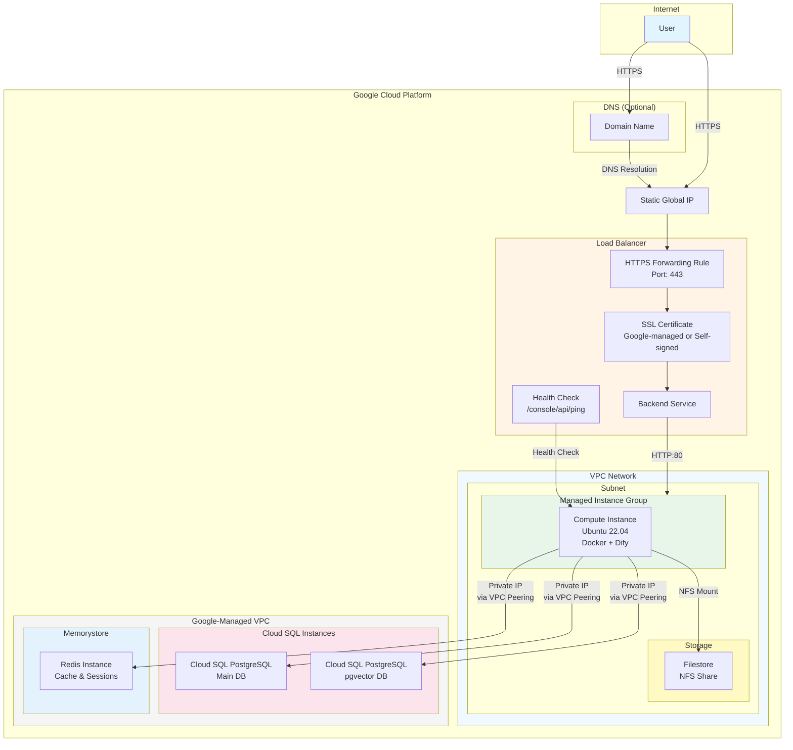

# 🚀 Dify on Google Cloud — Terraform Deployment
<a id="markdown-%F0%9F%9A%80-dify-on-google-cloud-%E2%80%94-terraform-deployment" name="%F0%9F%9A%80-dify-on-google-cloud-%E2%80%94-terraform-deployment"></a>

This Terraform code deploys [Dify](https://github.com/langgenius/dify) on Google Cloud Platform (GCP) using the Community Edition, with the following design principles:

- 🔄 **Stay up-to-date** — Follow Dify Community Edition upgrades seamlessly.
- ✂️ **Minimal changes** — No patching of the Dify codebase.
- ☁️ **Fully managed** — Leverage GCP managed services for database, file storage, and cache.

## 📋 Table of Contents
<a id="markdown-%F0%9F%93%8B-table-of-contents" name="%F0%9F%93%8B-table-of-contents"></a>

<!-- TOC -->

- [🚀 Dify on Google Cloud — Terraform Deployment](#-dify-on-google-cloud--terraform-deployment)
    - [📋 Table of Contents](#-table-of-contents)
    - [🧩 Components](#-components)
    - [🏗️ Architecture Overview](#-architecture-overview)
    - [💰 Cost Estimation](#-cost-estimation)
    - [✅ Prerequisites](#-prerequisites)
    - [⚡ Quick Start](#-quick-start)
        - [📝 Prepare Variables File](#-prepare-variables-file)
        - [🚀 Deploy](#-deploy)
        - [🎉 After Deployment](#-after-deployment)
    - [⚙️ Detailed Configuration](#-detailed-configuration)
        - [🔒 SSL Certificate Setup](#-ssl-certificate-setup)
            - [✨ Option 1: Google-Managed SSL Certificate Recommended](#-option-1-google-managed-ssl-certificate-recommended)
            - [🔧 Option 2: Self-Signed Certificate](#-option-2-self-signed-certificate)
        - [🛡️ Identity-Aware Proxy IAP Configuration](#-identity-aware-proxy-iap-configuration)
            - [🔑 Enable IAP](#-enable-iap)
            - [👥 IAP Member Format](#-iap-member-format)
            - [🧪 Testing IAP](#-testing-iap)
        - [📦 Additional Sandbox Packages](#-additional-sandbox-packages)
    - [🚢 Dify Deployment](#-dify-deployment)
        - [⬆️ Upgrade Strategy](#-upgrade-strategy)
    - [🔧 Troubleshooting](#-troubleshooting)
        - [🔐 Verify SSL Certificate Provisioning](#-verify-ssl-certificate-provisioning)
        - [📄 Check Startup Script Log](#-check-startup-script-log)
        - [🐳 Check Dify Logs](#-check-dify-logs)
    - [🗑️ Resource Cleanup](#-resource-cleanup)

<!-- /TOC -->

## 🧩 Components
<a id="markdown-%F0%9F%A7%A9-components" name="%F0%9F%A7%A9-components"></a>

This Terraform code creates the following GCP resources:

| Category | Resources |
|---|---|
| 🌐 **Network** | VPC network & subnet, Private Service Access, Firewall rules, Static external IP |
| 🗄️ **Database** | Cloud SQL (PostgreSQL) — Main DB, Cloud SQL (PostgreSQL + pgvector) — Vector DB |
| 💾 **Storage** | Filestore — File uploads & plugin assets |
| ⚡ **Cache** | Memorystore for Redis — Caching & session storage |
| 🖥️ **Compute** | Managed Instance Group, Custom startup script |
| ⚖️ **Load Balancer** | HTTPS Load Balancer, SSL certificates (managed or self-signed) |
| 🔑 **IAM** | Service account for Dify, Auto-assigned required permissions |

## 🏗️ Architecture Overview
<a id="markdown-%F0%9F%8F%97%EF%B8%8F-architecture-overview" name="%F0%9F%8F%97%EF%B8%8F-architecture-overview"></a>



## 💰 Cost Estimation
<a id="markdown-%F0%9F%92%B0-cost-estimation" name="%F0%9F%92%B0-cost-estimation"></a>

[](https://dashboard.infracost.io/org/nenegi01mo/repos/d8e48f68-1e25-418e-9539-39a0e8ad0119?tab=branches)

## ✅ Prerequisites
<a id="markdown-%E2%9C%85-prerequisites" name="%E2%9C%85-prerequisites"></a>

1. ☁️ **Google Cloud SDK**: `gcloud` command installed
2. 🏗️ **Terraform**: Version 1.0 or higher
3. 📁 **GCP Project**: Active GCP project
4. 🔑 **Required IAM Roles**: The account running Terraform must have the following roles on the target GCP project:
   | Role | Purpose |
   |---|---|
   | `roles/compute.admin` | VPC, subnets, firewalls, instance templates, MIG, load balancer, SSL certificates |
   | `roles/iam.serviceAccountAdmin` | Create the Dify service account |
   | `roles/iam.serviceAccountUser` | Attach the service account to VM instances |
   | `roles/resourcemanager.projectIamAdmin` | Grant IAM roles to the Dify service account |
   | `roles/cloudsql.admin` | Create and manage Cloud SQL (PostgreSQL) instances |
   | `roles/redis.admin` | Create and manage Memorystore for Redis |
   | `roles/file.editor` | Create and manage Filestore instances |
   | `roles/servicenetworking.networksAdmin` | Create private VPC connections for Cloud SQL and Redis |
   | `roles/iap.admin` | *(Optional)* Configure Identity-Aware Proxy (IAP) |
5. 🔐 **Authentication Setup**:
   ```bash
   gcloud init
   gcloud auth application-default login
   ```
6. 🔧 **Enable Required APIs**:
   ```bash
   gcloud services enable cloudresourcemanager.googleapis.com
   gcloud services enable compute.googleapis.com
   gcloud services enable file.googleapis.com
   gcloud services enable iamcredentials.googleapis.com
   gcloud services enable redis.googleapis.com
   gcloud services enable servicenetworking.googleapis.com
   gcloud services enable sqladmin.googleapis.com
   gcloud services enable certificatemanager.googleapis.com
   
   # Optional: Enable if using Identity-Aware Proxy🛡️
   gcloud services enable iap.googleapis.com
   ```

## ⚡ Quick Start
<a id="markdown-%E2%9A%A1-quick-start" name="%E2%9A%A1-quick-start"></a>

### 📝 Prepare Variables File
<a id="markdown-%F0%9F%93%9D-prepare-variables-file" name="%F0%9F%93%9D-prepare-variables-file"></a>

```bash
cp terraform.tfvars.example terraform.tfvars
```

Edit `terraform.tfvars` and set **at least** the following values:

```hcl
project_id = "your-gcp-project-id"

# Dify version to be deployed
dify_version = "1.13.0"

# If you have a domain name (recommended)
domain_name = "dify.example.com"

# Or use self-signed certificate
# domain_name     = ""
# ssl_certificate = file("certificate.pem")
# ssl_private_key = file("private-key.pem")
```

### 🚀 Deploy
<a id="markdown-%F0%9F%9A%80-deploy" name="%F0%9F%9A%80-deploy"></a>

```bash
# Initialize
terraform init

# Review plan
terraform plan

# Execute deployment
terraform apply
```

### 🎉 After Deployment
<a id="markdown-%F0%9F%8E%89-after-deployment" name="%F0%9F%8E%89-after-deployment"></a>

```bash
# Check admin password
terraform output -raw initial_password

# Access via browser
# https://<load_balancer_ip> or https://your-domain.com
```

## ⚙️ Detailed Configuration
<a id="markdown-%E2%9A%99%EF%B8%8F-detailed-configuration" name="%E2%9A%99%EF%B8%8F-detailed-configuration"></a>

### 🔒 SSL Certificate Setup
<a id="markdown-%F0%9F%94%92-ssl-certificate-setup" name="%F0%9F%94%92-ssl-certificate-setup"></a>

#### ✨ Option 1: Google-Managed SSL Certificate (Recommended)
<a id="markdown-%E2%9C%A8-option-1%3A-google-managed-ssl-certificate-recommended" name="%E2%9C%A8-option-1%3A-google-managed-ssl-certificate-recommended"></a>

```hcl
domain_name = "dify.example.com"
```

Configure DNS record:

```
A    dify.example.com    <LOAD_BALANCER_IP>
```

Certificate provisioning can take up to 15 minutes.

#### 🔧 Option 2: Self-Signed Certificate
<a id="markdown-%F0%9F%94%A7-option-2%3A-self-signed-certificate" name="%F0%9F%94%A7-option-2%3A-self-signed-certificate"></a>

```bash
# Generate certificate
openssl req -x509 -nodes -days 365 -newkey rsa:2048 \
  -keyout private-key.pem -out certificate.pem \
  -subj "/C=JP/ST=Tokyo/L=Tokyo/O=Dify/CN=dify.local"
```

```hcl
domain_name     = ""
ssl_certificate = file("certificate.pem")
ssl_private_key = file("private-key.pem")
```

### 🛡️ Identity-Aware Proxy (IAP) Configuration
<a id="markdown-%F0%9F%9B%A1%EF%B8%8F-identity-aware-proxy-iap-configuration" name="%F0%9F%9B%A1%EF%B8%8F-identity-aware-proxy-iap-configuration"></a>

Identity-Aware Proxy (IAP) adds Google authentication to your application, ensuring only authorized users can access it.

#### 🔑 Enable IAP
<a id="markdown-%F0%9F%94%91-enable-iap" name="%F0%9F%94%91-enable-iap"></a>

1. **Create OAuth 2.0 Credentials**:
   - Go to [GCP Console > APIs & Services > Credentials](https://console.cloud.google.com/apis/credentials)
   - Click "Create Credentials" > "OAuth client ID"
   - Application type: "Web application"
   - Create and save the Client ID and Client Secret
   - Add authorized redirect URI: `https://iap.googleapis.com/v1/oauth/clientIds/<CLIENT_ID>:handleRedirect`

2. **Enable IAP API**:
   ```bash
   gcloud services enable iap.googleapis.com
   ```

3. **Configure terraform.tfvars**:
   ```hcl
   iap_enabled              = true
   iap_oauth_client_id      = "123456789-abc.apps.googleusercontent.com"
   iap_oauth_client_secret  = "your-client-secret"
   iap_members = [
     "user:admin@example.com",
     "group:developers@example.com",
     "domain:example.com"
   ]
   ```

4. **Apply Configuration**:
   ```bash
   terraform apply
   ```

#### 👥 IAP Member Format
<a id="markdown-%F0%9F%91%A5-iap-member-format" name="%F0%9F%91%A5-iap-member-format"></a>

| Type | Format |
|---|---|
| 👤 Individual user | `user:email@example.com` |
| 👥 Google Group | `group:groupname@example.com` |
| 🏢 Domain | `domain:example.com` |
| 🤖 Service account | `serviceAccount:name@project.iam.gserviceaccount.com` |

#### 🧪 Testing IAP
<a id="markdown-%F0%9F%A7%AA-testing-iap" name="%F0%9F%A7%AA-testing-iap"></a>

After deployment, accessing your application will require users to:
1. 🔐 Sign in with their Google account
2. ✅ Be granted access if they are in the `iap_members` list

### 📦 Additional Sandbox Packages
<a id="markdown-%F0%9F%93%A6-additional-sandbox-packages" name="%F0%9F%93%A6-additional-sandbox-packages"></a>

If you want to add packages to sandbox, write packages into [python-requirements.txt](./assets/sandbox/python-requirements.txt).

> [!note]
> dify-sandbox restricts system calls by default.
> When you add packages into requirements.txt, all system calls are enabled by [`./assets/sandbox/config.yaml`](./assets/sandbox/config.yaml).
> Please refer to [this document](https://github.com/langgenius/dify-sandbox/blob/2d0ad28fcfa7e3958311c8622d2e0c7b939feb24/FAQ.md?plain=1#L51).

## 🚢 Dify Deployment
<a id="markdown-%F0%9F%9A%A2-dify-deployment" name="%F0%9F%9A%A2-dify-deployment"></a>

When Terraform is applied:

1. 📥 Dify source code (of the specified version) is automatically downloaded to `/opt/dify-<version>`.
2. ✏️ Update Dify environment variables via [startup-script.sh](./assets/startup-script.sh).
3. ▶️ Start the Dify application.

### ⬆️ Upgrade Strategy
<a id="markdown-%E2%AC%86%EF%B8%8F-upgrade-strategy" name="%E2%AC%86%EF%B8%8F-upgrade-strategy"></a>

[Check Dify Release Notes](https://github.com/langgenius/dify/releases) and update [startup-script.sh](./assets/startup-script.sh) if needed.

```hcl
dify_version = "1.13.x"  # Specify new version tag
```

```bash
terraform apply  # Apply upgrade
```

When Terraform is applied:

1. 🔴 The old VM is removed first — the service will be **temporarily unavailable** during the upgrade.
2. 🟢 A new VM is deployed with the migration process.

> ⏱️ Upgrade can take up to **15 minutes**.

## 🔧 Troubleshooting
<a id="markdown-%F0%9F%94%A7-troubleshooting" name="%F0%9F%94%A7-troubleshooting"></a>

### 🔐 Verify SSL Certificate Provisioning
<a id="markdown-%F0%9F%94%90-verify-ssl-certificate-provisioning" name="%F0%9F%94%90-verify-ssl-certificate-provisioning"></a>

```bash
# Check certificate status
gcloud compute ssl-certificates list
gcloud compute ssl-certificates describe dify-ssl-cert --global
```

### 📄 Check Startup Script Log
<a id="markdown-%F0%9F%93%84-check-startup-script-log" name="%F0%9F%93%84-check-startup-script-log"></a>

Access the VM via SSH and check logs:

```bash
tail -f /var/log/startup-script.log
```

### 🐳 Check Dify Logs
<a id="markdown-%F0%9F%90%B3-check-dify-logs" name="%F0%9F%90%B3-check-dify-logs"></a>

Access the VM via SSH and check logs:

```bash
sudo su - ubuntu
cd /opt/dify-<version>/docker
docker compose ps
docker compose logs -f
```

## 🗑️ Resource Cleanup
<a id="markdown-%F0%9F%97%91%EF%B8%8F-resource-cleanup" name="%F0%9F%97%91%EF%B8%8F-resource-cleanup"></a>

> ⚠️ **Warning**: This will permanently delete all provisioned resources.

```bash
# Delete all resources
terraform destroy

# If you get errors due to deletion protection, remove them from the GCP Console first,
# then run destroy again
terraform destroy
```
